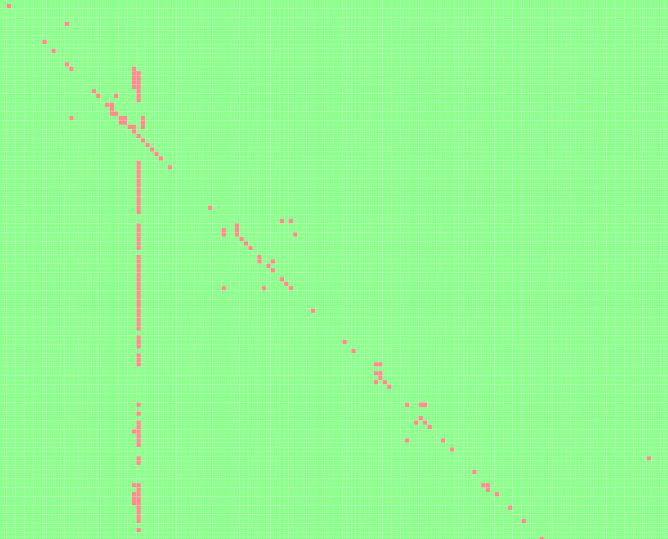

usio
====
This project provides scripts for creating an US input-output database for the
use in [openLCA](http://www.openlca.org/). It creates a direct requirements 
matrix from the [BEA make and use tables](http://www.bea.gov/industry/io_benchmark.htm). 
This DR matrix is than combined with a satellite matrix and converted to a set of 
process dates sets in the [olca-schema format](https://github.com/GreenDelta/olca-schema) 
which can be imported into openLCA. The satellite matrix is based on the 
satellite matrix of the OpenIO database but was mapped to the flows of the 
openLCA reference list.

Usage
-----
In order to build the database using the scripts in this repository you need to 
have Python 3.x and [NumPy](http://www.numpy.org/) installed (for Windows you 
can find NumPy binaries here: http://www.lfd.uci.edu/~gohlke/pythonlibs/). If
this is the case, just download this repository and execute the `make.py` 
script:

    python make.py
    
This will create a usio\_[description].zip file in the `build` directory.

Data flow
---------
The data package is created with the following steps:

1. The original BEA make and use tables are converted to a simple CSV matrix
format (see the matrix format description below).

2. From these make and use tables a direct requirements matrix is calculated
as described in [Concepts and Methods of the U.S. Input-Output Accounts][1] 
(see Chapter 12).

3. This direct requirement matrix is then combined with a satellite matrix
and converted into a set of process data sets. The CSV tables of the satellite
matrix and a JSON-LD package template are already prepared and stored in the 
data folder.

[1]:http://www.bea.gov/papers/pdf/IOmanual_092906.pdf "Karen J. Horowitz, Mark A. Planting: Concepts and Methods of the U.S. Input-Output Accounts. 2006"

Configuration
-------------
By default the BEA make and use tables _after redefinition_ are taken to 
calculate the direct requirement matrix but the script also works with the
tables before redefinitions (which are also included in the data folder). The
creation of the direct requirements matrix can be configured to apply scrap
adjustments and to remove value added sectors or not:

    # no scrap adjustments and removal of value added sectors
    import iodb    
    iodb.create_drc_matrix(make_csv_file, use_csv_file, dr_csv_file)

    # now with scrap adjustments and removal of value added sectors
    iodb.create_drc_matrix(make_csv_file, use_csv_file, drc_csv_file, 
                           scrap='Scrap', value_added=['VA1', 'VA2'])

Additionally, the different build steps are independent from each other and
consume and produce simple data formats. Thus, it should be possible to update
the data sources (e.g. by using the BEA 2007 statistics) without much effort.

The CSV matrix format
---------------------
The data processing is based on matrices that are stored in a simple CSV file
format which describes the content of a matrix with 3 columns: a row identifier
(a string), a column identifier (a string), the value of the respective row
and column (a number). Here is an example of how the content of such a file may
look like:

    "A","A",300
    "A","B",25
    "A","Scrap",3
    "B","A",30
    "B","B",360
    "B","C",20
    "B","Scrap",2
    "C","B",15
    "C","C",250

This repository contains also a small tool for comparing two matrices in this 
format. See the [diffexample.py script](scripts/diffexample.py) in the scripts
folder for how to use this tool. Additionally, there is a Excel macro for
converting matrices in Excel into this matrix format in the script folder.